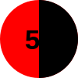
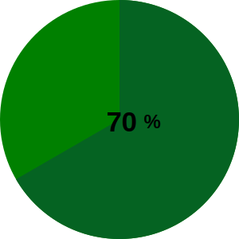
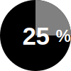
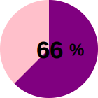

#Percentage Circle Svg
This PHP class allows you to get Percentage Circle Svg. Really customizable, you can change the radius, the percentage, the stroke width, the colors, the text, etc...

##How to use it
```
$svg = new PercentageCircleSvg(50, 25);
print $svg->getSvg();
```


```
$svg = new PercentageCircleSvg(150, 70, 20, '#056322', 'green');
print $svg->getSvg();
```


```
$svg = new PercentageCircleSvg(50, 25, 30, 'grey', 'black', 'white', 'white', 'none');
print $svg->getSvg();
```


```
$svg = new PercentageCircleSvg(70, 66, 5, 'purple', 'pink');
print $svg->getSvg();
```
